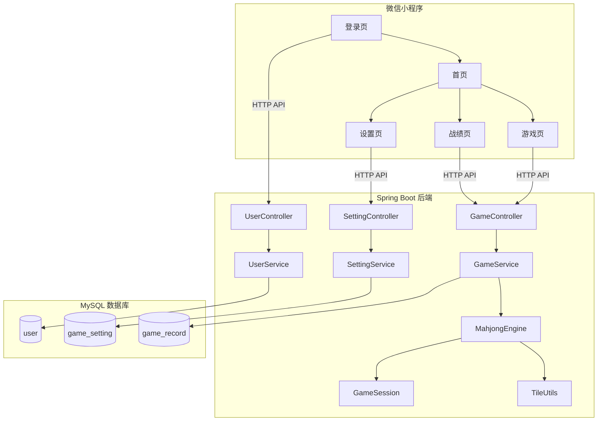
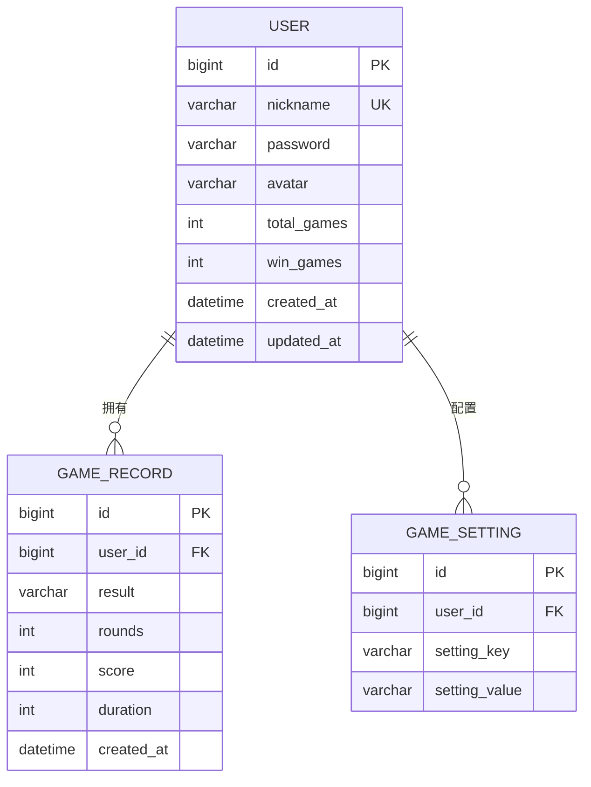

# 项目设计文档 - 国风麻将微信小程序

## 1. 系统架构

## 2. 数据模型

## 3. 接口清单

### 用户模块 (UserController)
- [POST] /api/user/login - 用户登录
- [POST] /api/user/register - 用户注册
- [GET] /api/user/info - 获取当前用户信息

### 游戏模块 (GameController)
- [POST] /api/game/start - 创建新游戏
- [POST] /api/game/{gameId}/discard - 玩家出牌
- [POST] /api/game/{gameId}/action - 玩家操作（吃/碰/杠/胡/过）
- [GET] /api/game/{gameId}/state - 获取游戏状态
- [GET] /api/game/history - 获取历史记录
- [GET] /api/game/stats - 获取统计数据

### 设置模块 (SettingController)
- [GET] /api/settings - 获取用户设置
- [PUT] /api/settings - 更新用户设置

## 4. 页面清单

| 页面 | 路径 | 功能描述 |
|------|------|---------|
| 登录页 | pages/login/login | 账号登录/注册，表单校验 |
| 首页 | pages/index/index | 用户信息展示、开始游戏、快捷统计、最近战绩 |
| 游戏页 | pages/game/game | 麻将牌桌，手牌操作，AI对战，游戏结算 |
| 战绩页 | pages/history/history | 统计总览、对局记录列表 |
| 设置页 | pages/settings/settings | AI速度、音效、自动理牌、账号信息 |

## 5. 示例数据规划

- **用户表**: 2 个测试账号（admin/user），含历史统计
- **游戏记录**: 每个用户 6~8 条示例记录，覆盖胜/负/平三种结果
- **游戏设置**: 每个用户 4 项默认设置
- 数据通过 `database-mysql/init.sql` 在数据库初始化时自动插入

## 6. 前端设计规范

### 6.1 设计方向
- 美学风格: 国风古韵 + 温润雅致
- 设计关键词: 竹青、纸色、楷书、沉稳、传统

### 6.2 色彩体系
- 主色 (Primary): #1B5E20 — 深翠绿，牌桌底色，品牌调性
- 辅色 (Secondary): #795548 — 古木棕，文字与边框
- 强调色 (Accent): #FF6F00 — 琥珀橙，按钮与高亮
- 中性色: #F5F0E8(背景) / #FFFDF5(卡片) / #3E2723(正文) / #A1887F(辅助文字)
- 语义色: Success #2E7D32 / Warning #F57F17 / Error #C62828 / Info #1565C0
- 60-30-10 分配: 60% 纸色背景 / 30% 翠绿主色 / 10% 琥珀强调

### 6.3 字体体系
- 标题字体: STKaiti / KaiTi / Noto Serif SC (楷书衬线，传统韵味)
- 正文字体: Noto Sans SC / PingFang SC (现代无衬线，清晰易读)
- 字号阶梯: xs(22rpx) / sm(24rpx) / base(28rpx) / lg(32rpx) / xl(36rpx) / 2xl(44rpx) / 3xl(56rpx) / 4xl(64rpx)

### 6.4 间距与布局
- 4px 基准间距: 8rpx / 16rpx / 24rpx / 32rpx / 48rpx / 64rpx
- rpx 自适应微信小程序各屏幕
- Flex 布局为主，Grid 用于统计网格

### 6.5 组件规范
- 圆角: sm(8rpx) / md(16rpx) / lg(24rpx) / xl(32rpx)
- 阴影: sm / md / lg 三级
- 牌面: 渐变背景 + 阴影 + 圆角，仿真实麻将质感

### 6.6 动效规范
- 过渡时长: 快 150ms / 中 250ms / 慢 400ms
- 缓动函数: ease, ease-in-out
- 牌面选中: translateY 上移动效
- 结算弹窗: scale + opacity 入场动画
- 按钮: scale(0.92~0.96) 点击反馈

### 6.7 平台适配说明
- 目标平台: 微信小程序
- 使用 rpx 适配不同屏幕
- CSS 动效为主（CSS Animation / Transition）
- 触摸交互为主，无 hover 态
- TabBar 固定底部导航

### 6.8 图片与媒体资源清单
- TabBar 图标 6 张: 首页/战绩/设置 各 2 张（普通+激活态）
- 牌面: 使用 CSS 渲染（楷书字体 + 渐变背景），无需外部图片
- 牌背: CSS 渐变 + 条纹纹理
